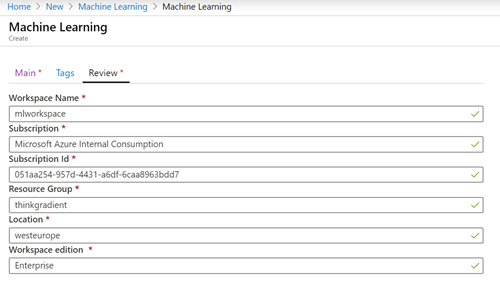
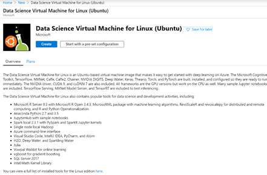

## Batch inferencing at Scale using Fast.ai model and Azure ML

### Prerequisites

-	Azure ML Workspace
-	Train Fast.ai model
-	Azure Data Science Virtual Machine (DSVM)  (optional)

### Start single instance
From the Azure Portal click on Create a Resource  > in the search box type Machine Learning and click the first Machine Learning link from the drop down > then type in the following formation:
-	Workspace Name:
	- Don’t use camel case, spaces, or special characters
- 	Subscription: 
	- Select your Pay as you Go subscription
-	Subscription Id: (auto populated once Subscription is selected)
	- Resource Group: 
		- Either create a new one or select an existing resource group
-	Location – region where you want your ML resources to be provisioned 
-	Workspace Edition:
	- Basic – if you don’t require Automated ML, Visual Designer, or Explainability
	- Enterprise if you need all of the above

<h1 align="center">
    

</h1>

### Setting up the training environment 

	You can either train the fast.ai model in your local machine, Azure ML managed compute, or in a Data Science VM. In our case, we will execute the training on a Data Science VM with GPUs. To create a Data Science VM go to Azure Portal and click on Create a Resource > in the search box type: Data Science VM and from the drop down select Data Science Virtual Machine for Linux (Ubuntu) > 

<h1 align="center">
    
     
</h1>
