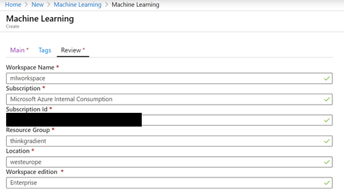
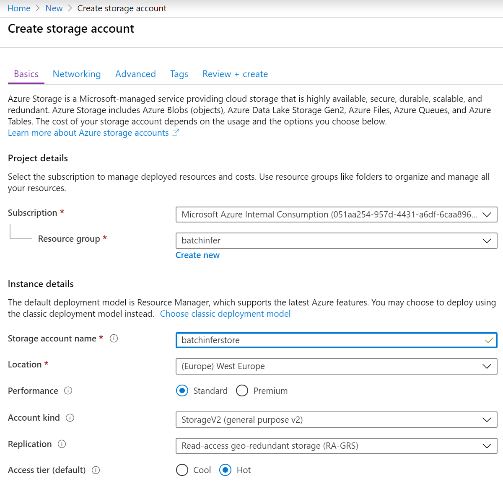

## Batch inferencing at Scale using Fast.ai model and Azure ML

### Prerequisites

-	Azure ML Workspace
-	Train Fast.ai model
-	Azure Data Science Virtual Machine (DSVM) with GPU  (optional)
    - Use DSVM with GPU if you want the training notebook to finish faster
-   Azure Storage Account

### Create Azure Machine Learning workspace
From the Azure Portal click on Create a Resource  > in the search box type Machine Learning and click the first Machine Learning link from the drop down > then type in the following formation:
-	Workspace Name:
	- Don’t use camel case, spaces, or special characters
- 	Subscription: 
	- Select your Pay as you Go subscription
-	Subscription Id: (auto populated once Subscription is selected)
	- Resource Group: 
		- Either create a new one or select an existing resource group
-	Location – region where you want your ML resources to be provisioned 
-	Workspace Edition:
	- Basic – if you don’t require Automated ML, Visual Designer, or Explainability
	- Enterprise if you need all of the above

<h1 align="center">
    
     
</h1>

### Setting up the DSVM training environment 

	You can either train the fast.ai model in your local machine, Azure ML managed compute, or in a Data Science VM. In our case, we will execute the training on a Data Science VM with GPUs to accelerate the convergence. To create a Data Science VM go to Azure Portal and click on Create a Resource > in the search box type: Data Science VM and from the drop down select Data Science Virtual Machine for Linux (Ubuntu)  

<h1 align="center">
    
     
</h1>

### Create an Azure storage account

	The storage account will be used to store the test images for inferencing and also the results of the inferencing. In the storage account we will create two containers to store the images and prediction/inference results.

To create the storage account log in to Azure Portal and click on Create a Resource > Storage account and fill in the the necessary information. Use the example below:

<h1 align="center">
    
     
</h1>

